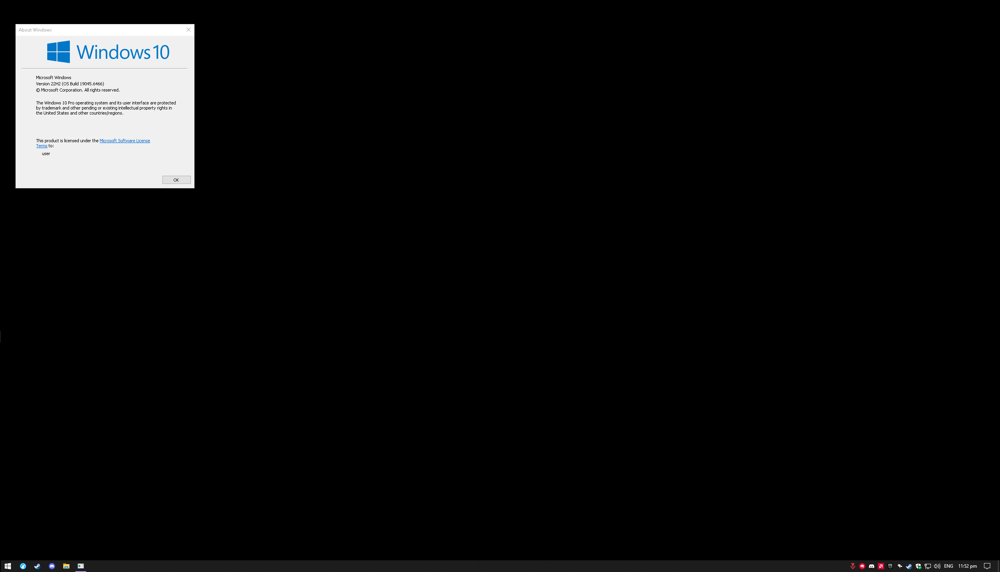

<h3 align="center">windows</h3>

## About
This is how I install & setup windows 10/11 for gaming  
Simple, clean and minimal to a sense without thirds party scripts to debloat windows  
I just have a web browser, game launchers, game recorder, drivers, misc.  
Included are my own `autounattend.xml` file that I made and use.

### Drivers for my pc
Gigabyte motherboard - gcc  
Amd gpu - amd adrenalin  
10g nic - intel 82599  

## Usage
I use the `autounattend.xml` created from https://schneegans.de/windows/unattend-generator/ to make an automated customized clean windows installation.

I use [ventoy](https://www.ventoy.net/) with its [Auto Installation Plugin](https://www.ventoy.net/en/plugin_autoinstall.html) so I can use the `autounattend.xml` with an unmodified Windows 10/11 iso. Otherwise I have to manually make a custom windows 10/11 iso with a `autounattend.xml` file.

## Post install

*Tip: Don't connect to internet if you don't have windows activation key, as you won't be able to customize windows as much if you do.

windows update  
display configuration  
set user password  

chocolately install https://chocolatey.org/install  
choco install librewolf vlc libreoffice nomacs 7zip discord handbrake  
choco install amd-software-adrenalin-edition  
choco install steam ubisoft-connect epicgameslauncher overwolf  

Sign in to Discord, Epic Games, Steam (Steam settings – Interface – Unselect Notify me...) (Steam settings – Downloads – Enable Game File Transfer over Local Network – Allow transfer from this PC to - Anyone)  
download outplayed and stats  

Install 10g network card driver, intel 82599, https://www.intel.com/content/www/us/en/download/15084/intel-ethernet-adapter-complete-driver-pack.html  
intel ethernet adapter complete driver pack  

gcc – Update centre – check – unselect Norton, Smart Backup, Intel XTU, Realtek Dragon

- check mouse accel off  
- black background + lockscreen  
- file explorer options  
- game mode + Power Options > set to High performance  
- add shortcuts to taskbar, pin Librewolf, Steam, Discord to taskbar  
- remove desktop icons  
- time/date check  
- task manager don't tart minimized and show logical cores  
- Performance Options: Click Adjust for best performance then untick: Show thumbnails instead of icons, Show window contents while dragging  
